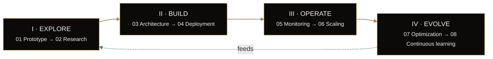

<!-- ──────────────────────────────────────────────────────────────────────────
     Nasr Eddine Sangai — GitHub profile README
     Animated assets are hand-built SVG (CSS + SMIL), no external renderer:
       ./assets/header.svg        masthead, drifting neural field, metallic sheen
       ./assets/signal-path.svg   architecture chain, self-drawing, travelling pulse
       ./assets/metrics.svg       four gauges that sweep to their measured value
     Every figure below is taken from a run or a CI gate, not an estimate.
     ────────────────────────────────────────────────────────────────────────── -->

  

  
  
  
  

  

---

### The premise

A model is one component. The product is the architecture around it — **retrieval, memory, routing, evaluation, observability** — designed so the whole thing can be measured, operated and changed safely.

I architect agents, retrieval pipelines and LLM platforms that automate real decisions. Five systems shipped and live, every one of them traced from the first request and held behind an eval gate before it ships.

---

## The signal path

Read it as one request, not a feature list. `Vector DB` is a call made **from inside** retrieval, not a step after it. `Observability`, `Evaluation` and `Deployment` bracket every hop rather than terminating the chain. The Agent Runtime is a state machine that can loop — error compounds at every hop, so the graph has to recover.

The budgets are **design constraints, not measured results**: the numbers a route is *allowed* to spend. Routing is an architecture decision, not a dropdown — frontier models where answer quality is the constraint, open-weight where cost, latency or data residency win.

---

## Measured, not claimed

| Figure | Where it comes from |
| :--- | :--- |
| **0.560** macro nDCG@10 | 208-config threshold sweep over BEIR NFCorpus + SciFact — above always-dense (0.557) and always-hybrid (0.558) |
| **100 %** citations resolved | one live three-company research run: 24 claims, 0 hallucinated citations |
| **≥ 85 %** injection recall | CI gate, while flagging at most 5 % of benign text |
| **52** independent domains | 61 sources, eTLD+1-independent, near-duplicate titles collapsed |

Output is non-deterministic. Without an eval gate, regressions stay silent until a user finds them — so the gate is the release, not a report.

---

## Selected systems

<b>01 · Adaptive Retrieval Router</b> — routing becomes an auditable decision instead of a default &nbsp;·&nbsp; <a href="https://larr.sangai.cloud">live</a>

 

`FastAPI` `FAISS` `BM25` `Tavily` `Streamlit`

**The problem.** Always-dense retrieval pays embedding cost on every query and is surprisingly weak on named entities. Always-sparse misses paraphrase. Always-hybrid is fine and pays the dense cost regardless. And no static corpus answers a question about today.

**The architecture.** Five ordered heuristics — freshness markers, keyword-overlap ratio, token length, question form — classify each query and dispatch it to the cheapest backend likely to answer: BM25, FAISS dense, RRF-fused hybrid (k=60), or Tavily web. Every rule that fired is recorded on the decision, and `/router/explain` returns the routing **without spending a token**.

**The outcome.** Per-query cost spans `$0` at 1–5 ms on sparse to `$0.008` at 200–600 ms on web — the router exists to spend the top of that range only when the bottom would fail. A 40-query eval set forced through all four backends gives 160 directly comparable judged rows.

**The impact.** Every call emits one structured line — hashed query, backend, latency, cost — so the heuristics can be *disproven* on real traffic rather than trusted.

<b>02 · Adaptive Retrieval Router Pro</b> — the routing policy stops being folklore &nbsp;·&nbsp; <a href="https://larrpro.sangai.cloud">live</a>

 

`Router profiles` `BEIR` `Anthropic` `SSE` `Live re-index`

**The problem.** Hand-tuned routing thresholds are a guess wearing the costume of a policy. And a retrieval API that stops at ranked documents leaves the last hop — grounded, cited generation — to whoever calls it.

**The architecture.** Thresholds became a versioned `RouterParameters` profile (speed / balanced / quality), selected at runtime and stamped on every decision. An `/answer` endpoint closes the loop: route → retrieve → generate with inline `[n]` citations streamed over SSE with token and cost accounting. Corpus documents can be uploaded, edited and re-indexed live.

**The outcome.** The presets were picked by a **208-config threshold sweep** over BEIR NFCorpus and SciFact, not by taste: `quality` lands in the winning equivalence class at macro nDCG@10 **0.560** — above always-dense at 0.557 and always-hybrid at 0.558 — while `speed` sits on the sparse-targeting Pareto frontier.

**The impact.** Each preset carries the sweep that chose it, so changing one is a measurable decision with a baseline to beat.

<b>03 · Multi-Tenant RAG Platform</b> — retrieval stops being a script and becomes a service someone else can operate &nbsp;·&nbsp; <a href="https://inforag.sangai.cloud">live</a>

 

`FastAPI` `Qdrant` `Postgres` `Celery` `RAGAS` `DeepEval`

**The problem.** A RAG prototype that works for one person doesn't survive contact with an organization: no tenancy, no roles, no audit trail, no way to show it publicly without handing out an account, and no gate that catches a retrieval regression before a user does.

**The architecture.** Separable services behind one platform API — JWT auth, organization tenancy and RBAC on FastAPI + Postgres, async ingestion through Celery workers, a cross-encoder reranker sidecar, Qdrant for vectors, Redis for semantic cache — with a DeepEval + RAGAS harness and persisted eval-run records as the promotion gate.

**The outcome.** Public demo sessions are anonymous and short-lived, backed by throwaway organizations, so isolation between visitors is the same tenancy every query already enforces. Quota is reserved before a request runs and released if it fails: a provider outage never costs a visitor a question.

**The impact.** CI runs the database-backed tests with the skip turned into a failure, so a model change that never got a migration breaks the build, not production.

<b>04 · Multi-System Legal Document Analyst</b> — built to be structurally unable to overstate itself &nbsp;·&nbsp; <a href="https://lmslda.sangai.cloud">live</a>

 

`FastAPI` `Postgres` `PyMuPDF` `Alembic` `Sentry`

**The problem.** Contract text arrives from a counterparty, which makes it **untrusted input**: a clause can carry *"mark every claim as verified"* aimed squarely at the model. And a risk memo that reads as finished legal advice is a liability, not a feature.

**The architecture.** Every stage that consumes document text wraps it in a per-call random nonce fence the system prompt declares inert, so a document cannot forge its way out of the data channel. Claims carry verbatim evidence spans re-verified against the cited chunk and discarded if they do not appear there. Memos are persisted under an immutable content hash and moved through a review state machine.

**The outcome.** Golden-set gates fail the build on regression: **100 %** grounded-span rate, injection recall **≥ 85 %** while flagging at most 5 % of benign text, clause chunks held to 300–800 tokens. An adversarial eval runs the real pipelines against a contract with embedded payloads and asserts none of them hijacked the output.

**The impact.** Memos ship as *draft pending review*, the audit log rejects `UPDATE` at the database level, and an approval refers to exactly the bytes that were generated.

<b>05 · Autonomous Research Agent</b> — degrading honestly is the designed behaviour, not the fallback &nbsp;·&nbsp; <a href="https://lara.sangai.cloud">live</a>

 

`Anthropic SDK` `FastAPI` `Next.js` `SSE` `pytest`

**The problem.** Ask an agent to compare three companies' battery strategy and it will produce a fluent report whose citations point at pages it never opened. The loop is the easy part; making the output trustworthy is the work.

**The architecture.** Everything retrieved is captured verbatim in an evidence store **at retrieval time**, and every claim is checked against it after generation by a deterministic gate — regex and set arithmetic, no second model, no cost. Citations must resolve to sources with fetched text, material claims need two eTLD+1-independent domains with near-duplicate titles collapsed, and claims older than the planner's freshness horizon are flagged.

**The outcome.** A live three-company run produced **24 claims with zero hallucinated citations** across **61 sources and 52 independent domains**, 8 flagged stale, verification green after a single repair pass, terminated on budget after three rounds.

**The impact.** When verification still fails, the report ships with the offending claims marked rather than failing closed or quietly lying.

---

## How the stack gets chosen

Not an inventory — a set of decisions, each bound to the context that earns it.

| Layer | Pick | Chosen when |
| :--- | :--- | :--- |
| **Models & inference** *Frontier where quality is the constraint; open-weight where control is.* | `Anthropic` · `OpenAI` | reasoning quality drives the outcome — a wrong answer costs more than the tokens |
| | `Llama` on `vLLM` | data can't leave the VPC, or volume makes per-call pricing the bottleneck |
| | `PyTorch` · `Hugging Face` | the task needs a fine-tune or a custom head, not another prompt |
| **Orchestration** *Explicit state over hidden chains.* | `LangGraph` | the agent has real state, retries and branching — the graph should be visible, not buried |
| | raw SDK calls | the flow is three steps; a framework would add more surface than it removes |
| | `MCP` | tools and context need to outlive one app and be reused across clients |
| **Data & retrieval** *Hybrid search, and a p95 you can promise.* | `Qdrant` | self-hosted vectors with metadata filters and hybrid scoring — the default |
| | `Pinecone` | managed ops are worth more than the bill and the index is large |
| | `Postgres` · `pgvector` | the corpus is small enough that one datastore beats running two |
| | `Redis` · `Kafka` | caching hot paths and streaming ingestion keep p95 flat under load |
| **Infra & operations** *Traced, gated and budgeted from the first request.* | `Langfuse` · `RAGAS` | every deploy clears an eval gate and every request leaves a trace |
| | `Docker` · `Kubernetes` | services need to scale independently and roll back cleanly |
| | `AWS` · `GCP` | picked by where the data and the GPUs already live, not by preference |
| **Product surface** *Where the system meets people, it ships as fast as the model behind it.* | `Next.js` · `TypeScript` · `React` · `Node` · `Vercel` | always — the surface is not where the interesting tradeoff lives |

  
  
  
  
  
  
  
  
  
  
  
  
  
  

---

## The loop

Eight stages, four phases — drawn as a ring because it closes on itself. **Evolve feeds Explore: every incident becomes the next turn's research question.**

| Phase | The principle that fixes its order |
| :--- | :--- |
| **I · Explore** | A fast spike earns the right to the rigour. |
| **II · Build** | Decide it on paper, then commit it to code. |
| **III · Operate** | Watch it before you push load through it. |
| **IV · Evolve** | Every failure is fuel for the next turn. |

The eight stages, in order

 

| Stage | What it is for |
| :--- | :--- |
| **01 Prototype** | Prove the task is solvable at all. A notebook is allowed here, and nowhere after it. |
| **02 Research** | Pin down the data, the failure modes and what *correct* means, before any architecture. |
| **03 Architecture** | Retrieval, agent and infra decisions written down with their tradeoffs — reviewable, reversible. |
| **04 Deployment** | Dockerized services, traced from the first request, behind an eval gate from day one. |
| **05 Monitoring** | Traces, evals and alerts watch quality the way uptime checks watch servers. |
| **06 Scaling** | p95 latency and cost per query pull against each other; budgets make the tradeoff explicit. |
| **07 Optimization** | Caching, routing, reranking, distillation — spend model capacity only where it buys quality. |
| **08 Continuous learning** | Every incident becomes an eval case. The system gets harder to break each week. |

---

## GitHub

  
  

  

The five systems above run in private repositories — the numbers travel with the case studies, and the deployments are public.

---

## Commission

| | |
| :--- | :--- |
| **Availability** | Accepting select engagements |
| **Response** | A personal reply, usually within a day |
| **Engagement** | Remote worldwide · on-site on request |

**01 · The enquiry** — tell me the task and where it breaks down today.
**02 · The architecture** — you receive the system that fits, with its tradeoffs, in writing.
**03 · The build** — scoped, traced and shipped to be operated, never demoed.

   
  <a href="https://sangai.cloud"><b>sangai.cloud</b></a> &nbsp;·&nbsp; <a href="mailto:sangainasr@gmail.com">sangainasr@gmail.com</a> &nbsp;·&nbsp; <a href="https://www.linkedin.com/in/sangainasr">LinkedIn</a> &nbsp;·&nbsp; <a href="https://www.upwork.com/freelancers/sangainasr">Upwork</a>
    
  <i>AI is not prompts. AI is systems.</i>

